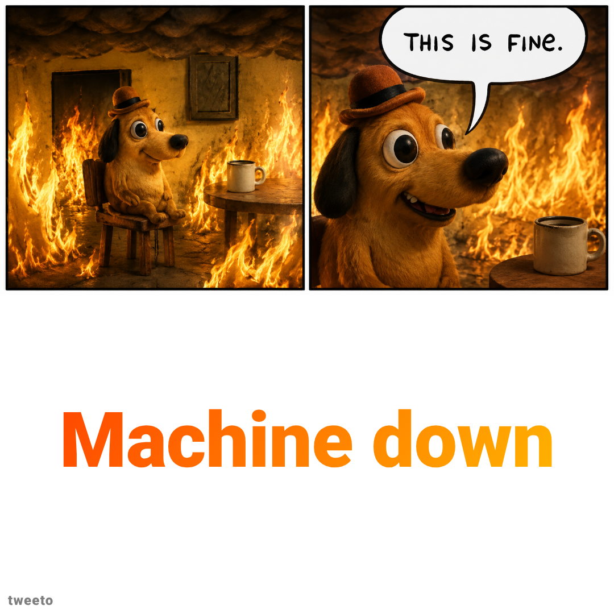
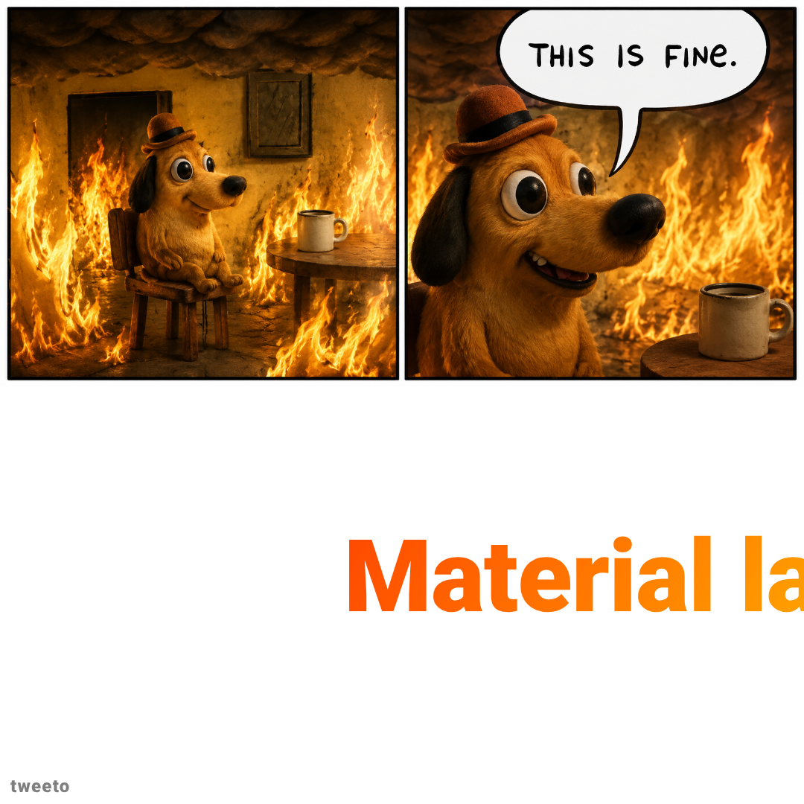
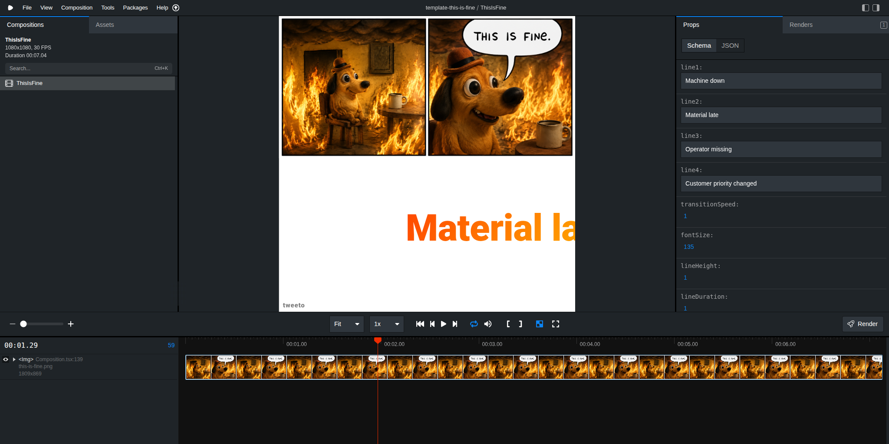

# template-this-is-fine

A [Remotion](https://www.remotion.dev/) template for "this is fine" meme-style videos: a background image fills the top portion of the frame while up to four bold gradient captions slide in one at a time from the right, each landing with a camera shake, then fly off to the left before the next one appears.

<p align="center">
  <a href="assets/template01.png"></a>
  <a href="assets/template02.png"></a>
</p>

## Using with an AI agent

Give this single line to Claude Code, Gemini, Codex, or any coding agent and it will know exactly what to do:

```
Clone https://github.com/davidtweeto/template-this-is-fine, run npm install, then edit the defaultProps in src/Root.tsx to set your four caption lines, backgroundFile, and watermark, and run npm run dev to preview in Remotion Studio.
```

For best results, also install the Remotion skill so your agent has deep Remotion domain knowledge:

```bash
npx skills add remotion-dev/skills
```

## Quick start

```bash
npm install
npm run dev
```

Open [http://localhost:3000](http://localhost:3000) in your browser to preview in Remotion Studio.

<p align="center">
  <a href="assets/studio.png"></a>
</p>

## Adding a background image

A default `this-is-fine.png` is included in `public/`. To use your own image, drop it into `public/` and update `backgroundFile` in `src/Root.tsx`:

```ts
backgroundFile: "my-image.png",
```

The image is displayed at the top of the frame with `objectFit: cover` — it occupies the top ~630px of the 1080×1080 canvas, and the captions appear in the lower portion.

## Customizing content

All composition props are editable live in Remotion Studio via the Props panel. The schema is defined in `src/Composition.tsx` using Zod. Edit `defaultProps` in `src/Root.tsx` to set your own values:

| Prop | What it controls |
|---|---|
| `line1`–`line4` | The four caption lines that appear in sequence |
| `transitionSpeed` | Multiplier for how fast lines slide in/out (1 = default, higher = faster) |
| `fontSize` | Font size for captions in px |
| `lineHeight` | Line height multiplier for multi-word captions that wrap |
| `lineDuration` | Seconds each caption stays on screen before flying off |
| `backgroundFile` | Filename inside `public/` for the background image |

## Animation sequence

Each caption:

1. **Slides in** from the right edge (eased linear)
2. **Lands** — the whole frame shakes with a damped-spring recoil
3. **Holds** for `lineDuration` seconds
4. **Flies off** to the left (cubic Bezier ease-in)

The total duration is calculated automatically from the number of lines, transition speed, and line duration — no need to set `durationInFrames` manually.

## Rendering

```bash
# Render the full video
npm run render

# Render a single frame for layout checks
npx remotion still ThisIsFine --frame=30 --scale=0.5
```

Output lands in `out/`.

## Structure

```
src/
  index.ts          — Remotion entry point
  index.css         — Tailwind / global styles
  Root.tsx          — Composition registration & default props
  Composition.tsx   — Main animation component + Zod schema (ThisIsFineComposition)
  constants.ts      — Shared animation timing constants
public/
  this-is-fine.png  — Default background image
```

## Built with Remotion

This template is built on [Remotion](https://www.remotion.dev/) — a framework for creating videos programmatically in React.

- Website: [remotion.dev](https://www.remotion.dev/)
- GitHub: [github.com/remotion-dev/remotion](https://github.com/remotion-dev/remotion)
